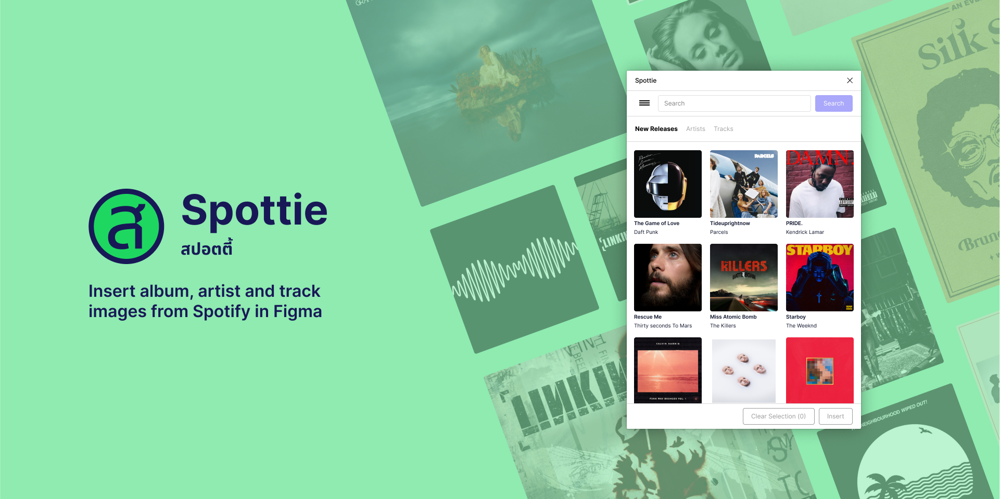

<h1 align="center">
	<a href="https://github.com/nathakits/spottie-figma-plugin">
		
	</a>
</div>

<p style="color:var(--color-text-tertiary);" align="center">
  Spottie is a Figma plugin for inserting album and track covers directly into your designs using Spotify API
</p>

<h4 align="center">
  Figma plugin built with Vue.js and Tailwind
</h4>

<!-- Install on Figma -->

## Usage
In Figma select main menu -> Plugins -> Spottie

- Browse or search for artists and tracks covers
- Click on the image to insert
- Long press on an image to multi-select images
- If an object is selected on the canvas, the insert will replace the object's fill
- Bonus! In the Tracks tab, double-click on any thumbnail to listen to the preview!

## Coming soon
- Search Podcast covers

## Installation and build setup
The project is separated into 2 sections. The main Figma code and the UI which is based on Vue and Tailwind.

#### For main Figma code
```bash
# install dependencies
$ npm install

# serve in watch mode
$ npm run watch

# build for production
$ npm run build
```

#### For UI
```bash
# install dependencies
$ npm install

# serve with hot reload at localhost:8080
$ npm run serve

# build for production
$ npm run build
```

## [UI Setup](UI/README.md)
Check out [instruction to setup Figma Plugin UI](UI/README.md)

## Figma setup guide
You can find instructions at: https://www.figma.com/plugin-docs/setup/

## Contributing
Pull requests are welcome. For major changes, please open an issue first to discuss what you would like to change.

## License
MIT [](LICENSE)
